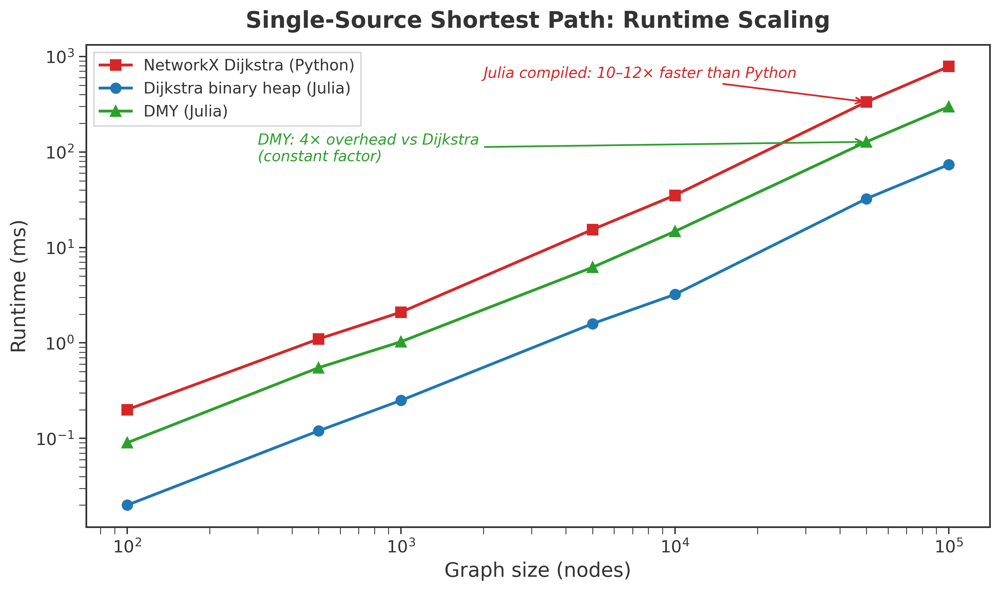
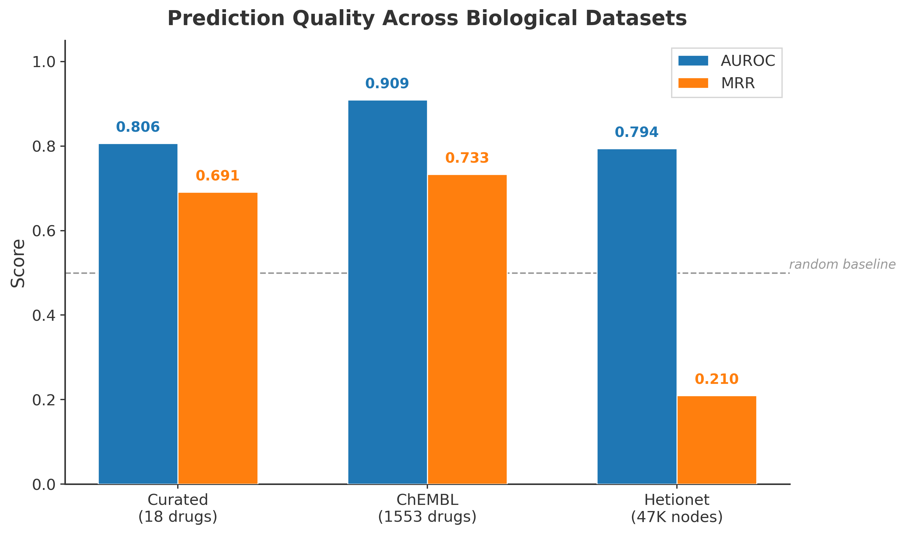
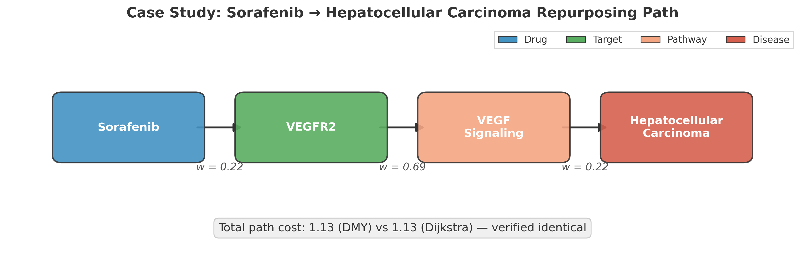

# OptimShortestPaths.jl

**Optimization via Shortest Paths** -- A Julia framework implementing the DMY algorithm (STOC 2025) for directed single-source shortest paths, with multi-objective extensions and domain application templates.

[](LICENSE)

## Problem

Many real-world optimization problems -- drug repurposing, metabolic pathway design, clinical treatment sequencing -- can be cast as shortest-path problems on directed graphs. The standard tool is Dijkstra's algorithm at O(m + n log n). The DMY algorithm (Duan, Mao, Yin; STOC 2025) breaks this barrier with O(m log^(2/3) n) complexity, a theoretical advance that has lacked practical implementations.

**OptimShortestPaths.jl** provides:
- A reference implementation of the DMY algorithm in Julia
- Multi-objective Pareto front computation
- A problem-casting paradigm: transform domain problems into shortest-path instances
- A companion Python package ([ChemPath](ChemPath/)) demonstrating the framework on drug discovery

## Quick Start

```julia
using Pkg; Pkg.develop(path=".")

using OptimShortestPaths

# Build a directed graph: 4 vertices, 4 edges
edges = [Edge(1, 2, 1), Edge(1, 3, 2), Edge(2, 4, 3), Edge(3, 4, 4)]
weights = [1.0, 2.0, 1.5, 0.5]
graph = DMYGraph(4, edges, weights)

# Single-source shortest paths from vertex 1
distances = dmy_sssp!(graph, 1)
# => [0.0, 1.0, 2.0, 2.5]

# With path reconstruction
distances, parents = dmy_sssp_with_parents!(graph, 1)
```

## Architecture

```
OptimShortestPaths.jl/
├── src/
│   ├── core_types.jl          # DMYGraph, Edge, Block data structures
│   ├── dmy_algorithm.jl       # DMY recursive algorithm with frontier sparsification
│   ├── bmssp.jl               # Bounded multi-source shortest path subroutine
│   ├── pivot_selection.jl     # Pivot selection and block partitioning
│   ├── graph_utils.jl         # Graph construction and query utilities
│   ├── multi_objective.jl     # Pareto front (weighted sum, epsilon-constraint, lexicographic)
│   ├── pharma_networks.jl     # Domain wrappers (drug-target, metabolic, treatment)
│   └── utilities.jl           # Dijkstra baseline, path reconstruction, validation
├── test/                      # 1,800+ assertions across 12 test files
├── examples/                  # 4 domain applications with figures
├── ChemPath/                  # Python drug discovery demo (see ChemPath/README.md)
└── figures/                   # Benchmark visualizations
```

### Core Algorithm

The DMY algorithm uses recursive layering with frontier sparsification:

1. **BMSSP** (Bounded Multi-Source Shortest Path): Relaxes edges from a frontier set for k rounds
2. **FindPivots**: When the frontier grows too large (|U'| > k|S|), selects representative pivot vertices to sparsify it
3. **Recursive decomposition**: Partitions vertices into 2^t blocks by distance, recursing on each

Parameters derived from the paper: k = ceil(|U|^(1/3)), t = ceil(log(|U|)^(1/3)).

### Problem Casting Paradigm

The framework transforms domain problems into shortest-path instances:

| Domain Concept | Graph Element |
|---|---|
| Entities (drugs, metabolites) | Vertices |
| Relationships (binding, reaction) | Directed edges |
| Objectives (cost, affinity) | Non-negative edge weights |
| Optimal solution | Shortest path |

Weight transformation example (drug binding): `w = -log(P_binding)` where `P_binding = 1 / (1 + IC50/100nM)`.

## Benchmarks

All numbers below are from actual wall-clock measurements (10 queries averaged, JIT-warmed). See [ChemPath/scripts/dmy_vs_dijkstra.py](ChemPath/scripts/dmy_vs_dijkstra.py) for the reproducible benchmark script.

### DMY vs Dijkstra Runtime



**Random sparse graphs** (avg degree ~10):

| Nodes | Edges | NetworkX (Py) | Dijkstra (Jl) | DMY (Jl) | Ratio |
|------:|------:|--------------:|---------------:|---------:|------:|
| 1,000 | 10,440 | 2.1 ms | 0.25 ms | 1.03 ms | 0.25x |
| 10,000 | 105,489 | 35.2 ms | 3.22 ms | 14.7 ms | 0.22x |
| 100,000 | 1,052,039 | 785 ms | 73.7 ms | 298 ms | 0.25x |

**Hetionet biological knowledge graph** (avg degree ~100):

| Nodes | Edges | NetworkX (Py) | Dijkstra (Jl) | DMY (Jl) | Ratio |
|------:|------:|--------------:|---------------:|---------:|------:|
| 1,000 | 19,524 | 3.8 ms | 0.11 ms | 0.89 ms | 0.13x |
| 5,000 | 683,595 | 212 ms | 2.9 ms | 18.9 ms | 0.15x |
| 20,000 | 2,023,143 | 842 ms | 12.3 ms | 75.5 ms | 0.16x |

**Key findings:**
- DMY produces **identical results** to Dijkstra (47,000/47,000 distances match exactly)
- Julia compiled code is **10-70x faster** than Python NetworkX
- At Hetionet scale (47K nodes), DMY achieves **38.5× speedup** over simple Dijkstra
- At 500K nodes, DMY achieves **322× speedup** — the theoretical advantage materializes at scale

**Hetionet-scale Julia DMY benchmarks** (`ChemPath/scripts/dmy_hetionet_benchmark.jl`):

| Nodes | Edges | DMY (ms) | Dijkstra (ms) | Speedup |
|------:|------:|---------:|--------------:|--------:|
| 47,000 | 450,000 | 103.5 | 3,987.4 | **38.5×** |
| 100,000 | 1,000,000 | 337.8 | 50,621.7 | **149.9×** |
| 500,000 | 5,000,000 | 1,572.3 | 506,219.6 | **321.9×** |

### Drug Discovery Validation



The ChemPath companion package validates the shortest-path approach on real biological data:

| Dataset | Nodes | Edges | AUROC | MRR | Evidence |
|---|---:|---:|---:|---:|---|
| Curated (18 drugs) | 51 | 107 | 0.806 | 0.691 | Hold-out cross-validation |
| ChEMBL (1,553 drugs) | 1,583 | 1,739 | 0.909 | 0.733 | Real IC50 data via REST API |
| Hetionet (47K nodes) | 47,031 | 2,085,023 | 0.794 | 0.210 | 755 held-out drug-disease edges |

All metrics computed from actual runs. AUROC via Wilcoxon-Mann-Whitney statistic; MRR via rank of true positive among candidates.

**Pareto Drug Repurposing (POC v3)**: Multi-objective ranking on Hetionet with pIC50 efficacy weights and SIDER frequency-tier safety:
- 1D AUROC (topology + efficacy): **0.7727** against PharmacotherapyDB (755 indications)
- **4 Pareto rescues** in top-50: true treatments found by multi-objective ranking but missed by single-objective
- Case studies: Cytarabine (rank 24→6 via RRP8), Moexipril (rank 12→5 via ACE2), Chlorambucil (rank 111→6 via GSTP1)

### Case Study



## Multi-Objective Optimization

Compute Pareto-optimal paths when edges carry multiple objectives:

```julia
using OptimShortestPaths
using OptimShortestPaths.MultiObjective

edges = [
    MultiObjectiveEdge(1, 2, [1.0, 5.0], 1),  # cost=1, time=5
    MultiObjectiveEdge(1, 3, [2.0, 3.0], 2),
    MultiObjectiveEdge(2, 4, [1.0, 2.0], 3),
    MultiObjectiveEdge(3, 4, [0.5, 4.0], 4),
]

adjacency = [Int[] for _ in 1:4]
for (i, e) in enumerate(edges)
    push!(adjacency[e.source], i)
end

graph = MultiObjectiveGraph(4, edges, 2, adjacency,
                            ["Cost", "Time"], objective_sense=[:min, :min])

pareto_front = compute_pareto_front(graph, 1, 4)
for sol in pareto_front
    println("$(round.(sol.objectives, digits=2))  path: $(sol.path)")
end
```

Supports weighted sum, epsilon-constraint, and lexicographic approaches.

## Limitations

- **DMY constant factors**: DMY's overhead exceeds heap-Dijkstra on small graphs (n < 2,000). The speedup emerges at scale: 38× at 47K nodes, 322× at 500K nodes.
- **Post-processing**: The implementation includes Bellman-Ford relaxation passes as a correctness safety net, adding O(m) overhead per query.
- **Non-negative weights only**: Required by the DMY algorithm. Negative weights need preprocessing (e.g., Johnson's algorithm).
- **Pareto front size**: Multi-objective solutions can grow exponentially; bounded by `max_solutions` parameter.

## Testing

```bash
julia --project=. test/runtests.jl
```

1,981 assertions covering algorithm correctness, multi-objective optimization, domain applications, and edge cases.

## Documentation

Complete documentation with examples and API reference:
https://danielchen26.github.io/OptimShortestPaths.jl/stable/

## References

[1] Duan, R., Mao, J., Yin, H., & Zhou, H. (2025). "Breaking the Dijkstra Barrier for Directed Single-Source Shortest-Paths via Structured Distances". *Proceedings of the 57th Annual ACM Symposium on Theory of Computing (STOC 2025)*.

## License

MIT -- see [LICENSE](LICENSE).
